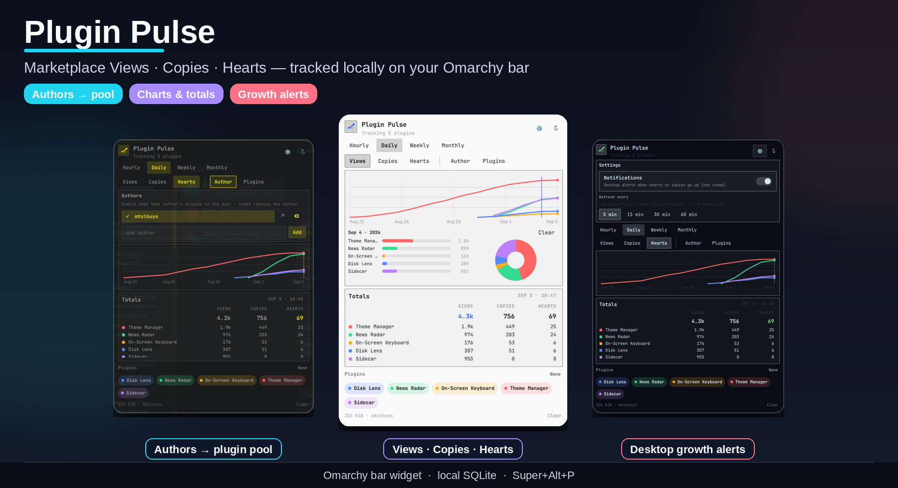

# Omarchy Plugin Pulse

<p align="center">
  
</p>

<p align="center"><b>Local-first Omarchy bar widget</b> for marketplace growth.<br/>
Track <b>Views · Copies · Hearts · Stars</b>, pool authors, and get alerts when you ship heat.</p>

## Install

```bash
omarchy plugin add https://github.com/mtolhuys/omarchy-plugin-pulse.git --enable
```

Update:

```bash
omarchy plugin update io.github.mtolhuys.plugin-pulse
```

Remove:

```bash
omarchy plugin remove io.github.mtolhuys.plugin-pulse
```

### Enable the bar widget

1. Install and enable the plugin (command above).
2. Open **Omarchy → Bar / Widgets** (or your bar layout settings).
3. Add **Plugin Pulse** to a bar section (defaults to the **right** section).
4. Click the pulse icon in the bar to open the panel. Middle-click refreshes.

Requires Omarchy Quattro with third-party `schemaVersion: 1` **service** + **bar-widget** support and Python 3 (stdlib only: `sqlite3`, `urllib`).

## What it shows

* Multi-series line charts for views / copies / hearts / stars
* Hourly · Daily · Weekly · Monthly resolutions
* Per-plugin toggles and a totals table
* Configurable author filter (matches author name, plugin id, or repo URL)
* Local SQLite size, archive, and clear controls

## Data sources

| Source | URL | Purpose |
| --- | --- | --- |
| Catalog | `https://raw.githubusercontent.com/omacom/omarchy-plugin-marketplace/main/site/catalog.json` | Plugin metadata + `listedAt` |
| Stats | `https://api.omarchyplugins.com/v1/stats` | Current views / copies / hearts |
| GitHub | `https://api.github.com/repos/{owner}/{repo}` | Current star count (per plugin repo) |

Requests are HTTPS-only, origin-allowlisted, size-bounded, and sent with a clear `User-Agent`. Nothing is uploaded.


## Estimated history

On the first write of each metric (views / copies / hearts / stars), Plugin Pulse seeds a **smooth monotonic curve** from ~0 at the marketplace `listedAt` timestamp up to the first observed value. The UI labels this **Estimated history**.

* It is a readability aid — **not** real historic GitHub star or marketplace traffic data.
* Seeding is **per metric**. A late-added metric (e.g. stars on a plugin that already had views/copies/hearts) still gets its own estimated curve, including a one-time backfill when live observes already exist without seeds.
* **Archive** copies the DB aside and drops seed points; live observes stay. **Clear** deletes samples.
* The panel shows **Estimated history** whenever any seed samples remain.

## Storage

State lives under `$XDG_STATE_HOME/omarchy-plugin-pulse/` (usually `~/.local/state/omarchy-plugin-pulse/`).

Retention aims for hourly detail (~72h), daily (~90d), weekly (~2y), and a tiny monthly tail, with a hard size cap near **8 MiB**. **Archive** copies the DB aside and drops seed points; **Clear** deletes samples.

## Development

```bash
make test
make validate
```

Helper CLI:

```bash
./bin/pulse collect
./bin/pulse snapshot --resolution daily
./bin/pulse status
```

## License

MIT — see [LICENSE](LICENSE).

## Keybinding

### Global (Hyprland)

Optional shortcuts (add to `~/.config/hypr/bindings.lua`):

```lua
o.bind("SUPER + ALT + P", "Omarchy Plugin Pulse", "omarchy-shell shell toggle io.github.mtolhuys.plugin-pulse")
o.bind("SUPER + ALT + SHIFT + P", "Plugin Pulse refresh", "omarchy-shell plugin-pulse-service collect")
```

Then `hyprctl reload`.

| Shortcut | Action |
| --- | --- |
| **Super + Alt + P** | Toggle the Plugin Pulse panel |
| **Super + Alt + Shift + P** | Refresh marketplace stats in the background (optional) |

`Super + K` lists global binds only — in-panel keys below are local to the open panel.

### In panel

A muted **Keys · ?** control sits in the header (left of Settings / Refresh). Press **?** (or click it) for a compact shortcut sheet.

| Shortcut | Action |
| --- | --- |
| **Esc** | Close help → cancel confirm → close settings → close panel |
| **q** | Close panel |
| **r** | Refresh / collect |
| **1 / 2 / 3 / 4** | Hourly / Daily / Weekly / Monthly |
| **v / c / h / s** | Views / Copies / Hearts / Stars |
| **a** | Toggle Authors |
| **p** | Toggle Plugins |
| **,** | Toggle Settings |
| **← / →** | Scrub chart time selection |
| **?** | Toggle Keys sheet |

Letter shortcuts are ignored while typing in the Authors / Plugins add fields. Middle-click the bar icon also refreshes.
